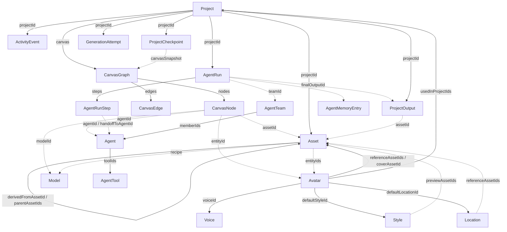

# 02 · Информационная архитектура

Chappy Web — фронтенд-прототип без бэкенда. Всё состояние живёт в `localStorage` (zustand `persist`), данные — сид/мок. Роутинг — `react-router-dom` (v6, `<Routes>`), карта роутов задаётся целиком в `src/App.tsx`. Приложение делится на **две зоны** с разными layout-обёртками:

- **Публичный сайт** — обёртка `PublicLayout` (`src/layouts/PublicLayout.tsx`): шапка, футер, маркетинговая навигация.
- **Рабочее пространство `/app`** — обёртка `AppLayout` (`src/layouts/AppLayout.tsx`): левый сайдбар, топбар, весь продукт.

Рабочие страницы (`/app/*`) грузятся через `React.lazy` — тяжёлый стек React Flow не попадает в бандл публичного лендинга. Общий `<Suspense fallback>` с компонентом `Loading` объявлен на уровне `App`.

Ключевой приём прототипа: нереализованные экраны не ведут в тупик, а показывают компонент `FuturePage` (`src/components/FuturePage.tsx`) — честную «страницу-заглушку» с описанием будущей фичи и кнопкой, уводящей в уже работающий раздел.

---

## Публичный сайт

Файл layout: `src/layouts/PublicLayout.tsx`.

Единственная полноценная страница — главная (`Home`, `src/pages/public/Home.tsx`). Все остальные публичные роуты — это `FuturePage`: продуктовые витрины (`/models`, `/video`, `/audio`, `/agents`, `/canvas`), витрины-направления (`/images`, `/chat`), карточка модели (`/models/:id`), тарифы (`/pricing`) и экраны аккаунта (`/login`, `/signup`). Регистрация/вход в прототипе имитируются — `FuturePage` предлагает «продолжить как демо-пользователь» и уводит в `/app`.

### Навигация публичного сайта

**Шапка** (`navLinks` в `PublicLayout.tsx`): Модели `/models` · Видео `/video` · Аудио `/audio` · Агенты `/agents` · Canvas `/canvas` · Тарифы `/pricing`. Справа — «Войти» `/login` и CTA «Начать бесплатно» → `/app`. Логотип ведёт на `/`.

**Футер** — три колонки ссылок:
- **Продукт:** Модели `/models`, Canvas `/canvas`, Агенты `/agents`, Тарифы `/pricing`.
- **Направления:** Изображения `/images`, Видео `/video`, Аудио `/audio`, Чат `/chat`.
- **Аккаунт:** Войти `/login`, Регистрация `/signup`, Открыть приложение `/app`.

Подвал содержит статичные строки-заглушки («внутренний прототип v0.1», «Оплата российской картой через ЮKassa») — платёжной интеграции нет.

---

## Рабочее пространство `/app`

Файл layout: `src/layouts/AppLayout.tsx`. Все дочерние роуты рендерятся в `<Outlet>` внутри `AppLayout`.

Реальные страницы (компоненты в `src/pages/app/`): `AppHome`, `CanvasHome`, `Projects`, `ProjectDetail`, `Agents`, `AgentDetail`, `AgentRunDetail`, `Assets`, `AssetDetail`, `Library` (экран «Аватары»), `AvatarDetail`, `Balance`, `Profile`.

Важные нюансы маршрутизации:
- **`ProjectDetail` доступен по двум путям** — `/app/canvas/:projectId` и `/app/projects/:id`. Это один и тот же экран проекта (canvas + панели), просто с двух точек входа. При переносе на прод стоит выбрать один канонический путь.
- **«Аватары» = компонент `Library`.** Роут `/app/avatars` рендерит `Library`, а `/app/avatars/:id` — `AvatarDetail`. Библиотека переиспользуемых сущностей (аватары/голоса/стили/локации) живёт под этим разделом.
- **`/app/runs/:id`** (`AgentRunDetail`) — детальная страница запуска агента, в сайдбар не вынесена, открывается по ссылке из проекта/агента.
- **Отложенный scope внутри `/app`** — роуты `create`, `music`, `models`, `history`, `settings` рендерят `FuturePage` и достижимы только по deep-link (в сайдбаре их нет). Каждый уводит в уже работающий эквивалент (например, `/app/history` → `/app/projects/pr-kira?tab=history`).

### Навигация рабочего пространства

**Сайдбар** (`groups` в `AppLayout.tsx`) — две группы:

| Группа | Пункт | Роут |
|---|---|---|
| **Рабочее пространство** | 🏠 Главная (`end`) | `/app` |
| | 🧩 Canvas | `/app/canvas` |
| | 🤖 Агенты | `/app/agents` |
| **Моё** | 📁 Проекты | `/app/projects` |
| | 🖼️ Ассеты | `/app/assets` |
| | 🎭 Аватары | `/app/avatars` |
| | 💳 Баланс | `/app/balance` |
| | 👤 Профиль | `/app/profile` |

Под навигацией — виджет баланса кредитов (шкала `credits / 1200`, кнопка «Пополнить» → `/app/balance`) и строка демо-пользователя (`demoUser` из `src/data/account.ts`) с «выходом» на `/`.

**Топбар:** бургер-меню (мобильный drawer), заголовок текущей страницы (мапа `titles`, с fallback «Проект» для `/app/projects*`), поле поиска (плейсхолдер, **не функционально**), пилюля баланса → `/app/balance`, аватар → `/app/profile`.

**Служебные компоненты layout:** `Toaster` (тосты из стора), `DemoBanner`, `DemoTour` — оверлеи демо-режима, монтируются один раз в `AppLayout`.

---

## Полная таблица роутов

Статусы: **real** — полноценная страница; **detail** — динамическая детальная страница (`:id`); **future** — честная заглушка `FuturePage`.

### Публичные (`PublicLayout`)

| Путь | Страница / компонент | Статус |
|---|---|---|
| `/` | `Home` | real |
| `/canvas` | `FuturePage` (→ `/app/canvas`) | future |
| `/agents` | `FuturePage` (→ `/app/agents`) | future |
| `/images` | `FuturePage` (→ `/app`) | future |
| `/video` | `FuturePage` (→ `/app`) | future |
| `/audio` | `FuturePage` (→ `/app`) | future |
| `/chat` | `FuturePage` (→ `/app`) | future |
| `/models` | `FuturePage` (→ `/app/canvas`) | future |
| `/models/:id` | `FuturePage` (→ `/app/canvas`) | future (detail) |
| `/pricing` | `FuturePage` (→ `/app/balance`) | future |
| `/login` | `FuturePage` (→ `/app`) | future |
| `/signup` | `FuturePage` (→ `/app`) | future |

### Рабочее пространство (`AppLayout`)

| Путь | Страница / компонент | Статус |
|---|---|---|
| `/app` (index) | `AppHome` | real |
| `/app/canvas` | `CanvasHome` | real |
| `/app/canvas/:projectId` | `ProjectDetail` | detail |
| `/app/agents` | `Agents` | real |
| `/app/agents/:id` | `AgentDetail` | detail |
| `/app/runs/:id` | `AgentRunDetail` | detail |
| `/app/projects` | `Projects` | real |
| `/app/projects/:id` | `ProjectDetail` | detail |
| `/app/assets` | `Assets` | real |
| `/app/assets/:id` | `AssetDetail` | detail |
| `/app/avatars` | `Library` | real |
| `/app/avatars/:id` | `AvatarDetail` | detail |
| `/app/balance` | `Balance` | real |
| `/app/profile` | `Profile` | real |
| `/app/create` | `FuturePage` (→ `/app/projects/pr-kira`) | future |
| `/app/music` | `FuturePage` | future |
| `/app/models` | `FuturePage` (→ `/app/canvas`) | future |
| `/app/history` | `FuturePage` (→ `/app/projects/pr-kira?tab=history`) | future |
| `/app/settings` | `FuturePage` (→ `/app/profile`) | future |

### Прочее

| Путь | Компонент | Статус |
|---|---|---|
| `*` | `NotFound` (внутри `App.tsx`) | real (404) |

---

## Основные сущности и связи

Все типы — в `src/types/index.ts`. Стор (`src/store/useStore.ts`) держит плоские массивы этих сущностей и связывает их по `id`-полям (нормализованная модель, а не вложенность). Персистится в `localStorage`; сиды инжектятся поверх (флагманский демо-проект «Кира» из `src/data/demoProject.ts` собирается поверх базовых сидов, чтобы приложение открывалось на живом наполненном проекте).

### Проект и Canvas
- `Project` — корневая единица работы (`type`: image | video | audio | mixed | content; `status`: active | draft | archived). Опционально содержит `canvas: CanvasGraph` и список `avatars: ID[]`.
- `CanvasGraph` — сериализуемый граф React Flow (`version`, `viewport`, `nodes`, `edges`), сохраняется дословно. Хранится внутри проекта; отдельный `saveCanvas(projectId, graph)` в сторе.
- `CanvasNode` → `CanvasNodeData` — узел-«блок» (один рендерер `'block'`, тип блока — в `data.type`: idea, text, source, model, llm, image, video, audio, avatar, voice, style, location, agent, export). Узел ссылается на другие сущности через `data`: `assetId`, `entityId`, `agentId`, `modelId`, а также хранит `recipe` и `status` генерации.
- `CanvasEdge` — направленное ребро (`source` → `target`), связывает блоки в единый процесс.

### Ассеты и происхождение (lineage)
- `Asset` — любой артефакт (`kind`: image | video | audio | document | text). Привязан к проекту через `projectId`. **Линия происхождения:** `derivedFromAssetId` (родитель) + `parentAssetIds[]` + `derivationType` (variation | edit | upscale | animate | extend | remix | agent_output). Готовая цепочка `as-l1 → as-l2 → as-l3` (оригинал → вариация → апскейл) лежит в `src/data/lineage.ts`.
- Ассет также ссылается на источник генерации: `modelId`, `providerId`, `generationJobId`, `agentRunId`, `canvasNodeId`, использованные сущности `entityIds[]` и рецепт `recipe: GenerationRecipe` (модель + промпт + параметры + avatar/voice/style/location).
- `GenerationAttempt` — попытка генерации (лог запроса к модели), привязана к `projectId`, `modelId`, входным `inputAssetIds[]`/`entityIds[]`, может произвести `assetId`.

### Агенты и запуски
- `Agent` — роль с инструкциями, `capabilities`, `toolIds[]`, `defaultModelId`, `memoryPolicy` (project | agent | none).
- `AgentTool` — инструмент агента (`type`: llm | project_context | asset_library | model_generation | mock_search | quality_check; флаг `isMock`).
- `AgentTeam` — команда агентов (`memberIds[]`, `coordinatorId`, `executionMode`: sequential | parallel, `approvalRequired`).
- `AgentRun` — запуск процесса: привязан к `projectId` (опц. `canvasNodeId`, `teamId`, `agentId`), содержит `inputContext: AgentRunContext` (idea/avatar/style/location/assets/model/canvasBlocks) и упорядоченный список `steps: AgentRunStep[]`. Каждый шаг ссылается на `agentId`, имеет `status`, вход/выход и опц. `handoffToAgentId` (передача следующему агенту). Результат — `finalOutputId`.
- `AgentMemoryEntry` — запись памяти со `scope` (agent | project), привязана к `agentId` и/или `projectId`, может ссылаться на `sourceRunId`.

### Провенанс проекта
- `ActivityEvent` — событие журнала проекта (`actorType`: user | agent | system; `type` — фиксированный набор `project.*` / `canvas.*` / `generation.*` / `asset.*` / `agent_run.*` / `checkpoint.*` / `project_output.*`), с ссылками на `assetId` / `agentRunId` / `canvasNodeId` / `entityId`.
- `ProjectCheckpoint` — снимок состояния проекта: `canvasSnapshot: CanvasGraph`, наборы `assetIds[]`, `entityIds[]`, `agentRunIds[]`, `reason` (automatic | manual | before_restore | approved_output). Стор умеет `createCheckpoint` / `restoreCheckpoint` / `forkProjectFromCheckpoint`.
- `ProjectOutput` — утверждённый результат проекта (`type`, `status`: draft | approved | final | archived), ссылается на `assetId` и опц. `approvedFromAgentRunId`.

### Переиспользуемые сущности (библиотека)
- `Avatar` — персонаж. Связи: `voiceId` → `Voice`, `defaultStyleId` → `Style`, `defaultLocationId` → `Location`, `referenceAssetIds[]`/`coverAssetId` → `Asset`, `usedInProjectIds[]` → `Project`.
- `Voice` / `Style` / `Location` — самостоятельные сущности; `Style` и `Location` держат `previewAssetIds`/`referenceAssetIds` → `Asset` и `promptFragment` для генерации.
- Референс-изображения сущностей хранятся как обычные `Asset` c `source: 'reference'` (см. `entityRefAssets` в `src/data/entities.ts`).
- `SavedEntity` (`kind`: avatar | voice | style | location) — обобщённая «карточка сохранённой сущности», используется как облегчённое представление там, где не нужен полный тип.

### Диаграмма связей

---

## Заметки для продакшена

- **Связи по `id`, не по вложенности.** В проде это ляжет на нормализованные таблицы/эндпоинты; вложенный `CanvasGraph` внутри `Project` — единственное исключение (граф сохраняется как единый JSON-блоб).
- **Два пути к `ProjectDetail`** (`/app/canvas/:projectId` и `/app/projects/:id`) — выбрать канонический и настроить редирект.
- **`FuturePage`-роуты** (`/app/create|music|models|history|settings` + большинство публичных) — это карта будущего scope; каждый уже указывает целевой рабочий экран через `primaryTo`.
- **Поиск в топбаре — заглушка** (просто `input` без обработчика). Глобальной истории/поиска нет — история и происхождение работают внутри проекта.
- **Аутентификация, платежи, каталог моделей как отдельные страницы** в прототипе отсутствуют — только имитация (`demoUser`, кредиты в сторе, модели прямо на Canvas).

**Ключевые файлы:** `src/App.tsx` (карта роутов), `src/layouts/AppLayout.tsx` (сайдбар/топбар), `src/layouts/PublicLayout.tsx` (публичная навигация), `src/types/index.ts` (доменная модель), `src/store/useStore.ts` (состояние и связи), `src/data/` (сиды: `demoProject.ts`, `entities.ts`, `lineage.ts`, `agents.ts`, `account.ts`, `models.ts`).